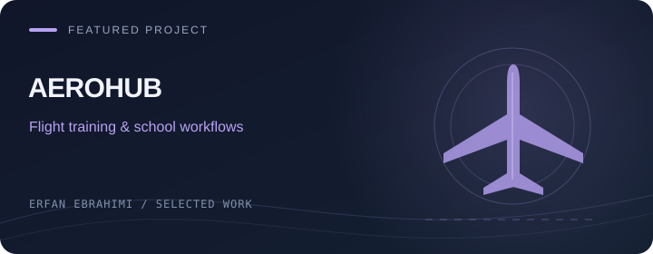
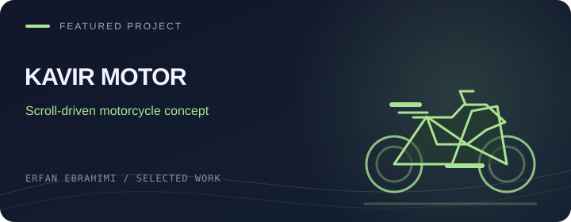

  

  
  &nbsp;
  
  &nbsp;
  

<h2 align="center">Software development, powered by ideas and AI.</h2>

I'm <strong>Erfan</strong>, a software developer working with <strong>React</strong> and <strong>Blazor</strong>. <strong>I can develop software with the help of AI, turning ideas into working applications.</strong> I also enjoy the details that make a web interface feel right.

سلام، من عرفان ابراهیمی هستم؛ توسعه‌دهنده نرم‌افزار. <strong>من می‌توانم با کمک هوش مصنوعی نرم‌افزار توسعه بدهم و ایده‌ها را به برنامه‌های کاربردی تبدیل کنم.</strong> به ساختن رابط‌های وب و جزئیاتی که تجربه کاربر را بهتر می‌کنند هم علاقه دارم.

 

### ⚡ My toolkit

   &nbsp;&nbsp;
   &nbsp;&nbsp;
   &nbsp;&nbsp;
   &nbsp;&nbsp;
   &nbsp;&nbsp;
   &nbsp;&nbsp;
   &nbsp;&nbsp;
  

React · Blazor · TypeScript · JavaScript · C# · Tailwind CSS · Vite · Git

Also in my projects: Sass · Bootstrap · Material UI · Framer Motion · Recharts · Axios

 

### ✦ Featured projects

My current focus: management software, aviation, sports and expressive web experiences.

<table>
  <tr>
    <td width="50%" valign="top">
      
      <h3>Ham-Sakhteman</h3>
      
<strong>هم‌ساختمان — مدیریت مجتمع</strong>

      
Residential complex management with unit, resident, fee and maintenance workflows.

      
<code>Blazor</code> <code>ASP.NET Core</code> <code>SQL Server</code>

      
Private source repository

    </td>
    <td width="50%" valign="top">
      
      <h3>Pahlevan</h3>
      
<strong>پهلوان — مدیریت مسابقات رزمی</strong>

      
Competition workflows from athlete registration and tournament draws to schedules, results and podiums.

      
<code>C#</code> <code>.NET</code> <code>Tournament workflows</code>

      
Private source repository

    </td>
  </tr>
  <tr>
    <td width="50%" valign="top">
      
      <h3>AeroHub</h3>
      
<strong>آئروهاب — مدیریت آموزش خلبانی</strong>

      
Flight school and pilot training management with course scheduling, flight logs and role-based dashboards.

      
<code>Blazor</code> <code>.NET</code> <code>PostgreSQL</code>

      
Private source repository

    </td>
    <td width="50%" valign="top">
      
      <h3>Kavir Motor Concept</h3>
      
<strong>کویر موتور — تجربه مفهومی نینجا</strong>

      
An independent Persian motorcycle showcase with cinematic scrolling and a 360° product presentation.

      
<code>React</code> <code>TypeScript</code> <code>GSAP</code>

      
Private source repository

    </td>
  </tr>
</table>

<table>
  <tr>
    <td width="100%" valign="top">
      
      <h3>Personal Portfolio</h3>
      
<strong>پورتفولیوی شخصی عرفان ابراهیمی</strong>

      
My Persian developer portfolio, featuring animated sections, skills and selected project showcases.

      
<code>React</code> <code>Framer Motion</code> <code>Sass</code>

      <a href="https://github.com/Erfan-Ebrahimi/erfan-cv"><strong>Explore the portfolio source ↗</strong></a>
    </td>
  </tr>
</table>

Project covers are illustrations. The first four projects have private source code.

  
<strong>Earlier interfaces &amp; experiments</strong>

   
  
<a href="https://github.com/Erfan-Ebrahimi/Net-Minder">Net-Minder</a> · <a href="https://github.com/Erfan-Ebrahimi/coffee-er">Coffee Store</a> · <a href="https://github.com/Erfan-Ebrahimi/erfan-shop">Erfan Shop</a> · <a href="https://github.com/Erfan-Ebrahimi/panel-er">Admin Panel</a> · <a href="https://github.com/Erfan-Ebrahimi/PRIXMA">PRIXMA</a> · <a href="https://github.com/Erfan-Ebrahimi/TRAVEL-ER">Travel Website</a>

  
Some earlier repositories are learning projects or work in progress. The <a href="https://github.com/Erfan-Ebrahimi/Sabz-full">Sabz front-end</a> was built against a pre-existing backend, which is included for integration.

 

  <a href="https://t.me/ME_7676"><strong>Say hello on Telegram ↗</strong></a>
  &nbsp; · &nbsp;
  <a href="https://www.instagram.com/__erfan__ebrahimi"><strong>Instagram ↗</strong></a>

<!-- Original visual design. Toolkit icons: Devicon (MIT); see assets/icons/LICENSE. Featured project covers: original illustrations; private source repositories stay private. -->
