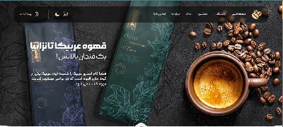
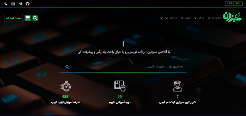
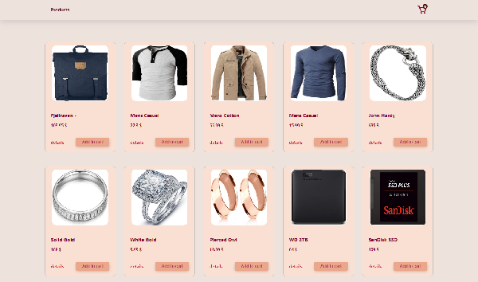
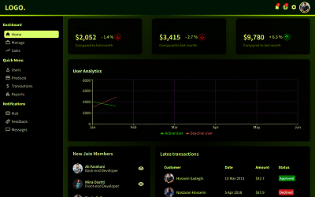
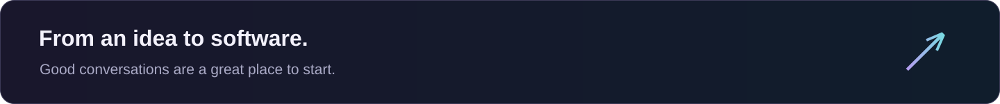

  

  
  &nbsp;
  
  &nbsp;
  

<h2 align="center">A developer with an eye for the details.</h2>

I'm <strong>Erfan</strong>, a front-end developer working with <strong>React</strong> and <strong>Blazor</strong>. I enjoy turning ideas into web interfaces with thoughtful components, styling and motion.

سلام، من عرفان ابراهیمی هستم؛ توسعه‌دهنده فرانت‌اند. از ساختن رابط‌های وب و پرداختن به جزئیاتی که تجربه کاربر را بهتر می‌کنند لذت می‌برم.

 

### ⚡ My toolkit

   &nbsp;&nbsp;
   &nbsp;&nbsp;
   &nbsp;&nbsp;
   &nbsp;&nbsp;
   &nbsp;&nbsp;
   &nbsp;&nbsp;
   &nbsp;&nbsp;
  

React · Blazor · TypeScript · JavaScript · C# · Tailwind CSS · Vite · Git

Also in my projects: Sass · Bootstrap · Material UI · Framer Motion · Recharts · Axios

 

### ✦ Selected interfaces

A few things I've built — with previews from my portfolio. Click a preview to explore the code.

<table>
  <tr>
    <td width="50%" valign="top">
      
      <h3>☕ Coffee Store</h3>
      
A Persian coffee storefront with product sections, carousels and a theme switch.

      
<code>React</code> <code>Tailwind CSS</code> <code>Swiper</code>

      <a href="https://github.com/Erfan-Ebrahimi/coffee-er"><strong>Explore the project ↗</strong></a>
    </td>
    <td width="50%" valign="top">
      
      <h3>🎓 Sabz Learning</h3>
      
Course, user and admin interfaces integrated with the included backend.

      
<code>React</code> <code>React Router</code> <code>Bootstrap</code>

      <a href="https://github.com/Erfan-Ebrahimi/Sabz-full"><strong>Explore the project ↗</strong></a>
    </td>
  </tr>
  <tr>
    <td width="50%" valign="top">
      
      <h3>🛍️ Erfan Shop</h3>
      
A product catalog and shopping cart with Context-based state and API data.

      
<code>React</code> <code>Context API</code> <code>Axios</code>

      <a href="https://github.com/Erfan-Ebrahimi/erfan-shop"><strong>Explore the project ↗</strong></a>
    </td>
    <td width="50%" valign="top">
      
      <h3>📊 Admin Panel</h3>
      
A dashboard practice project with data grids, charts and validated forms.

      
<code>Material UI</code> <code>Recharts</code> <code>Formik</code>

      <a href="https://github.com/Erfan-Ebrahimi/panel-er"><strong>Explore the project ↗</strong></a>
    </td>
  </tr>
</table>

  <strong>More to explore</strong>  
  <a href="https://github.com/Erfan-Ebrahimi/Net-Minder">Net-Minder</a> &nbsp; / &nbsp;
  <a href="https://github.com/Erfan-Ebrahimi/erfan-cv">Personal Portfolio</a> &nbsp; / &nbsp;
  <a href="https://github.com/Erfan-Ebrahimi/PRIXMA">PRIXMA</a> &nbsp; / &nbsp;
  <a href="https://github.com/Erfan-Ebrahimi/TRAVEL-ER">Travel Website</a>

  
<strong>More experiments &amp; project details</strong>

   
  
I also explore <a href="https://github.com/Erfan-Ebrahimi/weather-er">weather interfaces</a>, <a href="https://github.com/Erfan-Ebrahimi/youtube-er">video browsing</a> and <a href="https://github.com/Erfan-Ebrahimi/ikorc-ejt">company websites</a>. Each repository includes its stack and setup notes.

  
Some repositories are learning projects or work in progress. The Sabz front-end was built against a pre-existing backend, which is included for integration.

 

  <a href="https://t.me/ME_7676"><strong>Say hello on Telegram ↗</strong></a>
  &nbsp; · &nbsp;
  <a href="https://www.instagram.com/__erfan__ebrahimi"><strong>Instagram ↗</strong></a>

<!-- Original visual design. Toolkit icons: Devicon (MIT); see assets/icons/LICENSE. Project previews: existing public erfan-cv assets. -->
