  

  <a href="https://github.com/Erfan-Ebrahimi/erfan-cv"><strong>Portfolio source</strong></a>
  &nbsp; · &nbsp;
  <a href="https://github.com/Erfan-Ebrahimi?tab=repositories"><strong>Explore my projects</strong></a>

### A little about me

I'm Erfan, a front-end developer working with **React** and **Blazor**. I build web interfaces, from Persian storefronts and company websites to dashboards and API-connected applications.

I enjoy turning ideas into usable screens, working with reusable components, and exploring the details that make an interface feel right.

سلام، من عرفان ابراهیمی هستم؛ توسعه‌دهنده فرانت‌اند با تمرکز بر React و Blazor. اینجا مجموعه‌ای از نمونه‌کارها و تجربه‌های من در توسعه رابط‌های وب را می‌بینید.

### Technologies I work with

| Area | Technologies |
| :--- | :--- |
| Languages | JavaScript · TypeScript · C# · HTML · CSS |
| Front-end | React · Blazor · React Router |
| Styling & UI | Tailwind CSS · Sass · Bootstrap · Material UI |
| Motion & data | Framer Motion · Recharts · Axios · REST APIs |
| Development tools | Git · GitHub · Vite |

### Selected work

| Project | What you'll find | Stack |
| :--- | :--- | :--- |
| [**Net-Minder**](https://github.com/Erfan-Ebrahimi/Net-Minder) | Persian website introducing hotel reservation management products | HTML · CSS · JavaScript |
| [**Coffee Store**](https://github.com/Erfan-Ebrahimi/coffee-er) | Coffee storefront with product sections, carousels and a theme switch | React · Tailwind CSS · Vite |
| [**Erfan Shop**](https://github.com/Erfan-Ebrahimi/erfan-shop) | Product catalog and shopping cart with Context-based state | React · Context API · Axios |
| [**Sabz Learning Platform**](https://github.com/Erfan-Ebrahimi/Sabz-full) | Course website with user and admin interfaces, integrated with the included backend | React · React Router · Bootstrap |
| [**Admin Panel**](https://github.com/Erfan-Ebrahimi/panel-er) | Dashboard practice project with data grids, charts and forms | React · Material UI · Recharts |
| [**Personal Portfolio**](https://github.com/Erfan-Ebrahimi/erfan-cv) | Persian portfolio with animated sections, skills and project showcases | React · Framer Motion · Sass |

### More interface explorations

[PRIXMA — agency landing page](https://github.com/Erfan-Ebrahimi/PRIXMA) · [Travel website](https://github.com/Erfan-Ebrahimi/TRAVEL-ER) · [Weather app](https://github.com/Erfan-Ebrahimi/weather-er) · [Video browsing app](https://github.com/Erfan-Ebrahimi/youtube-er)

---

Thanks for visiting. Open a project to explore its source, stack and setup guide.

