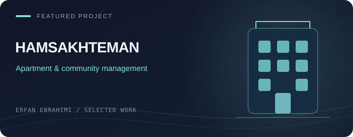

[← Back to my profile](https://github.com/Erfan-Ebrahimi#user-content--featured-projects)

# Ham-Sakhteman

**Residential complex management**

| Project | Details |
| --- | --- |
| Developer | Erfan Ebrahimi |
| Stack | Blazor · ASP.NET Core · C# / .NET · SQL Server |
| Source | Private repository |

## Project focus

Residential management involves connected workflows for buildings, units, residents, charges and maintenance.

## Main workflows

- Complex, unit and resident management
- Charges and residential fee workflows
- Maintenance requests and management

## معرفی فارسی

**هم‌ساختمان**

نرم‌افزاری برای مدیریت مجتمع مسکونی؛ شامل واحدها و ساکنان، شارژ ساختمان و درخواست‌های نگهداری. تمرکز پروژه روی کنار هم قرار دادن فرایندهای مدیریتی ساختمان است.

The source repository remains private. This page is a public overview and contains no application data or internal implementation files.

The cover is an illustration, not an application screenshot.

[Talk about a related project →](https://t.me/ME_7676)

