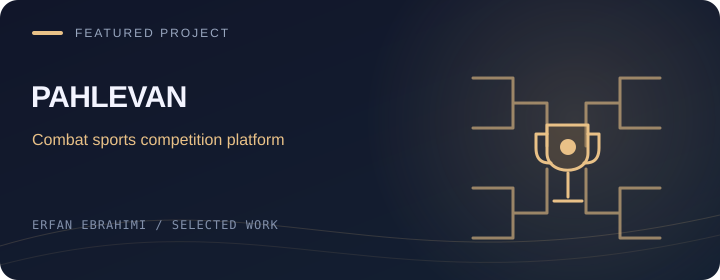

[← Back to my profile](../README.md#-featured-projects)

# Pahlevan

**Combat sports competition management**

| Project | Details |
| --- | --- |
| Developer | Erfan Ebrahimi |
| Stack | C# · .NET |
| Source | Private repository |

## Project focus

Running a combat sports competition connects athlete registration, tournament draws, scheduling and result management.

## Main workflows

- Athlete registration
- Tournament draws and competition schedules
- Results and podium workflows

## معرفی فارسی

**پهلوان**

پلتفرمی برای مدیریت مسابقات رزمی؛ از ثبت‌نام ورزشکاران و قرعه‌کشی تا برنامهٔ مسابقات، ثبت نتایج و سکوهای برتر.

The source repository remains private. This page is a public overview and contains no application data or internal implementation files.

The cover is an illustration, not an application screenshot.

[Talk about a related project →](https://t.me/ME_7676)

