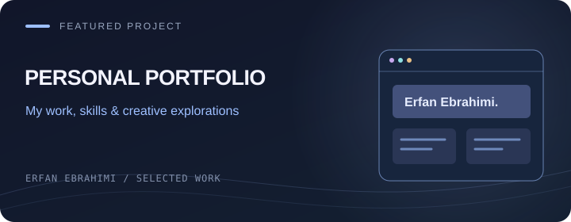

[← Back to my profile](../README.md#-featured-projects)

# Personal Portfolio

**Persian developer portfolio**

| Project | Details |
| --- | --- |
| Developer | Erfan Ebrahimi |
| Stack | React · Vite · Framer Motion · Sass |
| Source | [Public repository](https://github.com/Erfan-Ebrahimi/erfan-cv) |

## Project focus

My portfolio brings together my introduction, skills and selected projects in a Persian web experience.

## Main workflows

- Developer introduction and skills
- Selected project showcases
- Animated sections using Framer Motion

## معرفی فارسی

**پورتفولیوی شخصی عرفان ابراهیمی**

پورتفولیوی شخصی من برای معرفی مهارت‌ها و نمونه‌کارها؛ ساخته‌شده با React و بخش‌های متحرک با Framer Motion.

[Explore the source code →](https://github.com/Erfan-Ebrahimi/erfan-cv)

The cover is an illustration, not an application screenshot.

[Talk about a related project →](https://t.me/ME_7676)

